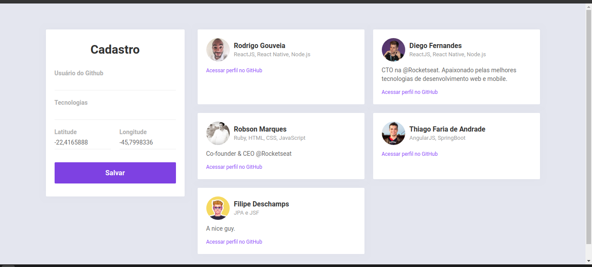

# Curso da Semana OmniStack 10 da Rocketseat

### Projeto

### Objetivo
O DevRadar é um projeto com objetivo de encontrar novos desenvolvedores pela região.

### Tecnologias usadas
- [Node.js](https://nodejs.org/en/)
- [React](https://reactjs.org)
- [React Native](https://facebook.github.io/react-native/)
- [Expo](https://expo.io/)

### Instrutor do curso
[Diego Fernandes](https://github.com/diego3g)

### Licença
Esse projeto está sob a licença MIT. Veja o arquivo [LICENSE](LICENSE.md) para mais detalhes.

